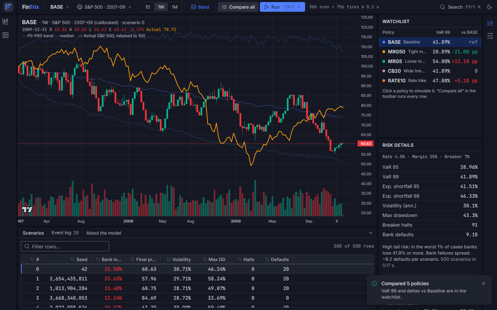
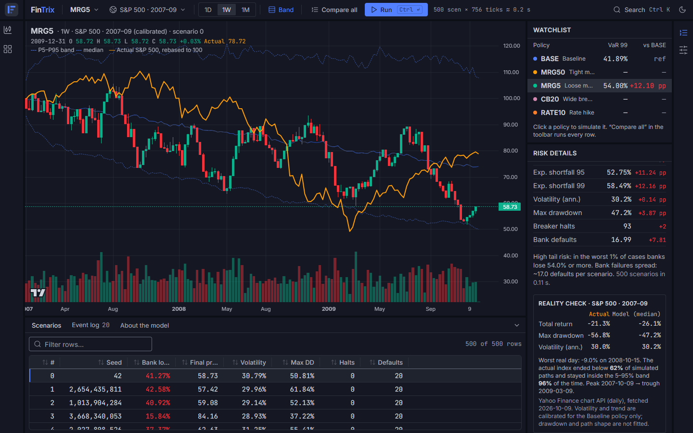
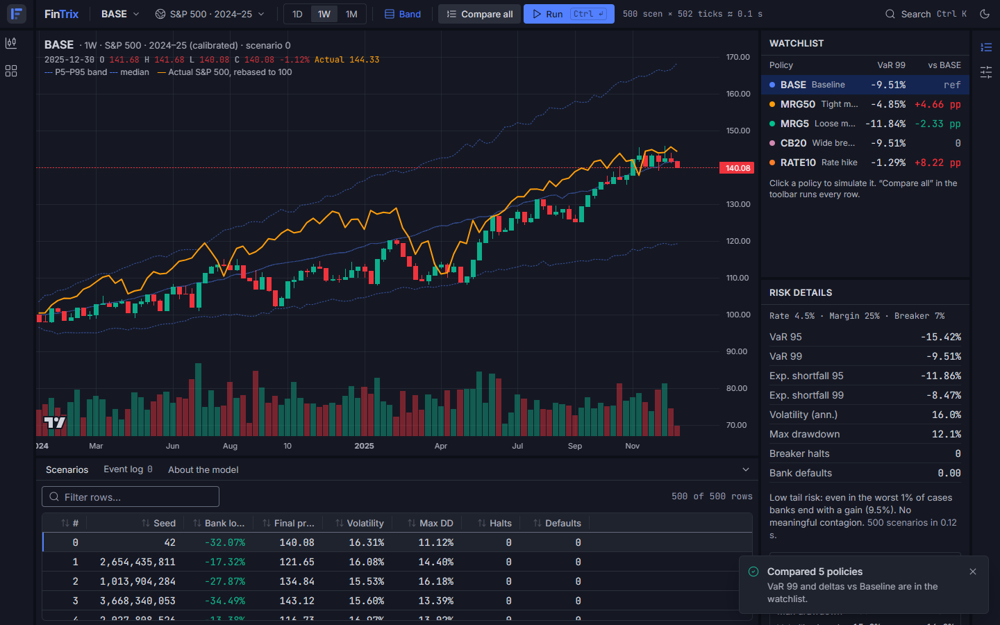
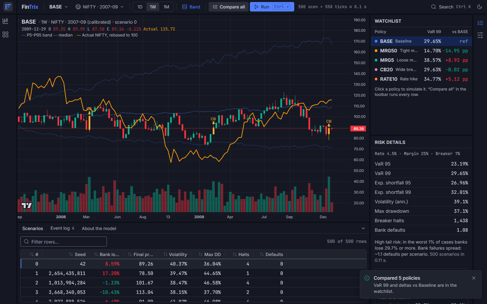
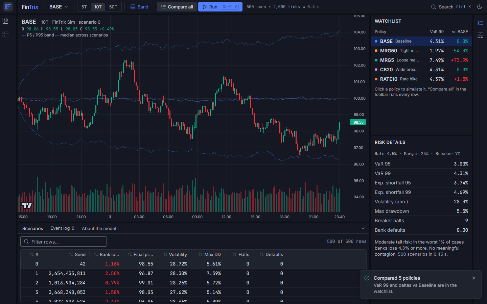
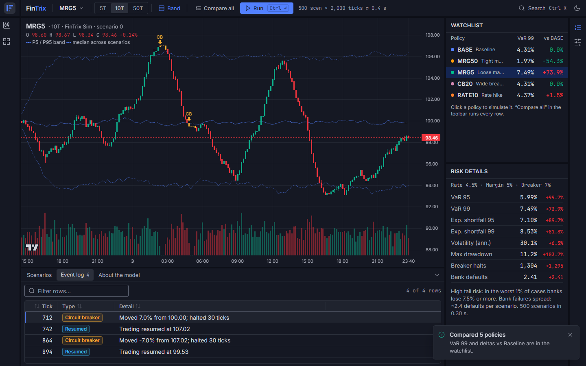
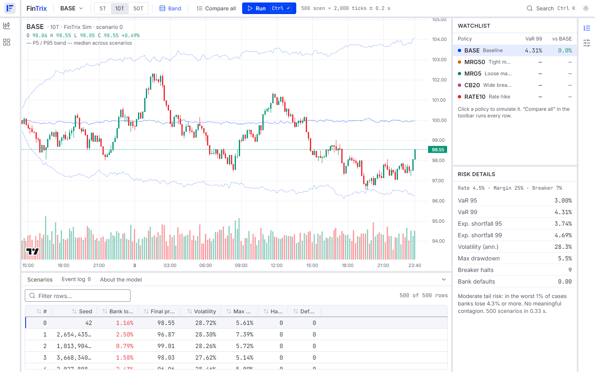

# FinTrix

**Policy stress-testing on an agent-based market simulator.** A regulator picks a policy (interest rate, margin requirement, circuit-breaker threshold) and runs hundreds of simulated markets under it. FinTrix shows how much risk the policy adds or removes, on a synthetic market or one calibrated to a real period such as the **2007–09 Global Financial Crisis**.

PBL project, Group 29 (High Performance Computing). Full feature guide: **[docs/FEATURES.md](docs/FEATURES.md)**.



> **Status:** the Policy Lab runs on an in-browser simulator (labelled _Synthetic_ in the app). The C++ engine with OpenMP, MPI, checkpointing and failover is the next phase. The UI already uses the same data contract, so only the data source changes.

---

## Features

- **Trading-terminal workspace** (TradingView-style): candlestick chart, policy watchlist, risk panel, resizable panels, dark and light themes.
- **5 policy presets** (BASE, MRG50, MRG5, CB20, RATE10), plus custom sliders. **Compare all** runs every policy in about 1.5 s.
- **Monte Carlo simulation**: 500 independent seeded markets per run, with fundamentalist, chartist and noise traders, margin-driven leverage, circuit breakers, and bank contagion across 20 banks.
- **Real market periods**: S&P 500 and NIFTY 50 for **2007–09** and **2024–25**, with the model calibrated to each period's real volatility and trend.
- **Reality check**: the actual index is overlaid on the simulation, with actual-versus-model return, drawdown and volatility.
- **Risk metrics**: VaR 95/99, expected shortfall, volatility, max drawdown, breaker halts and bank defaults, each with its difference from Baseline and a plain-English summary.
- **Scenario table and event log**: 500+ rows, virtualised, sortable and filterable; every halt and bank default is listed with its date.
- **Accessible and fast**: WCAG AA contrast enforced by tests, full keyboard control, a command palette (Ctrl+K), and 104 KB of initial JS.

## Screenshots

| Global Financial Crisis, loose margin                                              | 2024–25 bull market                                        |
| ---------------------------------------------------------------------------------- | ---------------------------------------------------------- |
|  |  |
| **NIFTY 50 2007–09**                                                               | **Synthetic market, all policies compared**                |
|                            |       |
| **Event log: circuit-breaker halts**                                               | **Light theme**                                            |
|                  |              |

## Key results (VaR 99, lower is safer)

| Policy               | Synthetic | S&P 500 2007–09 | S&P 500 2024–25 | NIFTY 50 2007–09 |
| -------------------- | --------- | --------------- | --------------- | ---------------- |
| BASE (baseline)      | 4.3%      | 41.9%           | −9.5% (gain)    | 29.7%            |
| MRG50 (tight margin) | 2.0%      | 20.9% (−21 pp)  | −4.9%           | 14.7% (−15 pp)   |
| MRG5 (loose margin)  | 7.5%      | 54.0% (+12 pp)  | −11.8%          | 38.6% (+9 pp)    |
| RATE10 (rate hike)   | 4.4%      | 47.1% (+5 pp)   | −1.3%           | 34.8% (+5 pp)    |

**Takeaway:** loose margin is the most dangerous policy in a crisis, yet it _looks_ safer in the 2024–25 bull market, because leverage multiplies gains. Policies need testing against crisis periods, not just recent calm years.

Calibration accuracy (Baseline volatility, real vs model): S&P 2007–09 **30.0% vs 30.1%**, S&P 2024–25 **15.9% vs 16.0%**, NIFTY 2007–09 **39.0% vs 39.1%**.

## Run it

```bash
cd fintrix
pnpm install        # Node ≥ 20, pnpm ≥ 9
pnpm dev            # http://localhost:5173
make check          # lint, typecheck, tests, build, bundle budget (same as CI)
```

## Architecture

```
fintrix/
├── packages/contract/        JSON Schema + OpenAPI, the single source of truth → generated TS types
├── apps/web/                 React 18 + TypeScript (strict) + Vite + Tailwind v4 + Radix
│   ├── src/lib/sim.ts        seeded market model + calibration (runs in a Web Worker)
│   ├── src/lib/market.ts     real-data statistics (volatility, drawdown, drift)
│   ├── src/data/market/      S&P 500 and NIFTY 50 daily data snapshots
│   ├── src/routes/lab/       Policy Lab: chart, watchlist, risk panel, tables
│   ├── src/styles/tokens.css design tokens (every colour and size)
│   └── src/ui/               component library (see /gallery)
├── docs/
│   ├── FEATURES.md           feature guide + demo script
│   ├── decisions.md          every design trade-off, one line each
│   └── screenshots/
└── .github/workflows/ci.yml  lint, typecheck, tests, build, bundle budget
```

Planned (later phases): `apps/gateway` (Fastify WebSocket gateway), `engine/` (C++17 + OpenMP + MPI), `supervisor/` (Python heartbeat, watchdog and failover).

## Quality

| Check             | Result                                                                          |
| ----------------- | ------------------------------------------------------------------------------- |
| Automated tests   | 94 passing (contract 16, web 78)                                                |
| Initial JS (gzip) | 104 KB of the 180 KB budget, enforced at build time                             |
| WCAG AA contrast  | All text, chart and border tokens pass in both themes (tested)                  |
| Historical data   | Verified in tests: S&P peak 2007-10-09, trough 2009-03-09, worst day 2008-10-15 |
| Lint / typecheck  | Zero errors, TypeScript strict                                                  |

## Data and limitations

- **Market data:** Yahoo Finance daily prices, for academic, non-commercial use. NIFTY 2007–09 starts in September 2007 (the source's history limit).
- **The model is simplified:** traders are grouped by type, and its shocks are normally distributed. It matches real volatility and trend but **underestimates crash depth** (S&P 2007–09 drawdown: model about −43%, actual −57%). The app's Reality check panel shows this gap.
- **Not a price forecast.** It compares the _relative_ effect of policies.

Details in [docs/FEATURES.md § Known limitations](docs/FEATURES.md#17-known-limitations).

## Team (Group 29)

| Member           | Area                                     |
| ---------------- | ---------------------------------------- |
| Kartik Merothiya | Architecture, integration, final report  |
| Dhairya Kumar    | Risk module: correlation, exposure graph |
| Devansh Gupta    | MPI: reduction, prefix sum, testing      |
| Gaurav Parashar  | Fault tolerance: checkpointing, failover |
| Nawaz Nayyar     | OpenMP, benchmarks, UI                   |
